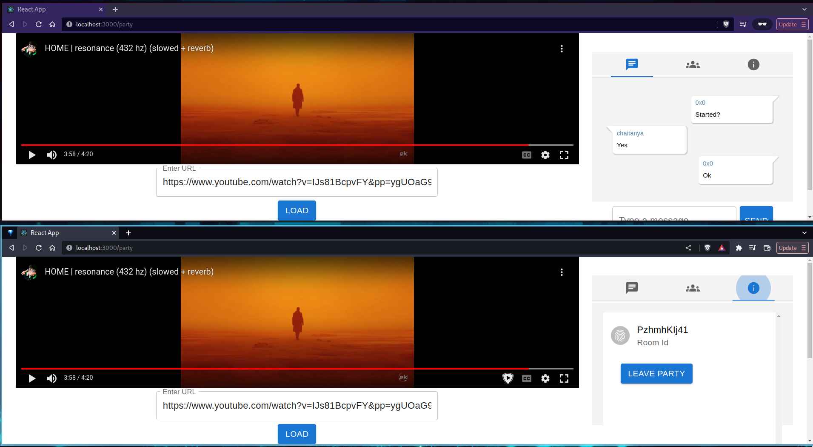

# Watch Party
A Virtual Watch Party Application that is built using React.js, Express.js, and socket.io.



## Features

- Synced playback across all users
- Public and Private rooms
- Chat
- Members in the party

## Client

Run the following commands to start the frontend server
```bash
cd client/
npm i 
npm start
```

## Server

Run the following commands to start the backend server.
```bash
cd server/
npm i 
npm start
```
